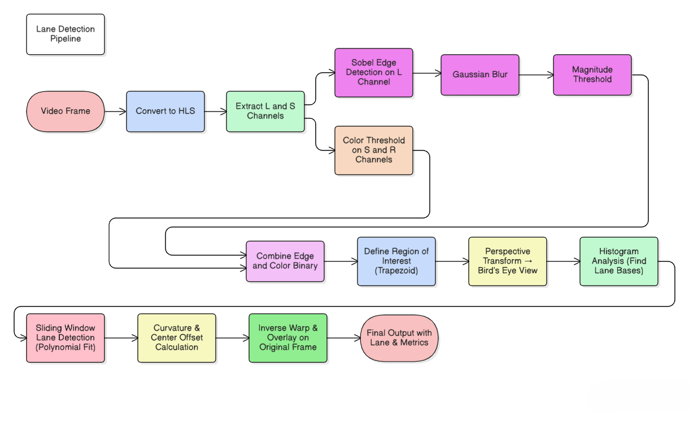

# Logs for my Autonomous Vehicle Project

## Image Processing - Machine Learning Setup

1. **Anaconda / Miniconda**
   - Why: Helps create isolated environments (No "library conflict").
   - You can make one environment for ML (Tensorflow, Torch, Opencv), another later for ROS2.
   - **Recommended**: Miniconda (lighter than full Anaconda, necessary reqirements can be installed whenever its required).
      - Miniconda gives CLI no GUI, but GUI can be installed separately.
        > Download **Miniconda Installers** from 
        >> https://www.anaconda.com/download/success

      - `Leave all checkbox Unchecked during miniconda installation`


     - Create a new conda environment *To make preoject dependencies independent*
     - **Open Anaconda Prompt**
       > conda create -n `project_name` python=3.10

       > conda env list

       > conda activate `project_name`

   
2. **JupyterLab / Jupyter Notebook**
   - `Install inside conda itself`
   - Why: For ML training and for integration with CARLA/Gazebo, running ROS2 nodes, and testing how the trained model works in the simulation.
   - Easier to show demo during presentation (e.g., run a simulation and display detection results live).
   - **Recomended**: JupyterLab.
         
      > conda install -c conda-forge jupyterlab

      > jupyter-lab --version


3. **OpenCV**
   - `Install inside conda itself`
   - Why: Handle images & videos from camera dataset.
   - Even if you don’t use OpenCV algorithms heavily, it’s needed to read frames and preprocess images for ML. 

      > pip install opencv-python

4. **numpy**
   - `Install inside conda itself`
   - Why: scientific computing library for Python.

      > pip install numpy

4. **matplotlib**
   - `Install inside conda itself`
   - Why: plotting library for Python.

      > pip install matplotlib

6. **PyCharm - Not Necessary**
   - `Install PyCharm in the OS`

   - Use miniconda environment from PyCharm

     > Miniconda Environment: `project_name` Linked to PyCharm Project

      > https://www.youtube.com/watch?v=LTlvcUWnjvc

7. **GitHub - Recomended**
   - `Use version control i.e, GitHub recomended`

---

## Learning Requirements

## Image processing - Basics

- **Introduction** -> Overview of computer vision concepts.
- **Computer Vision Basics** -> Core principles and applications in autonomous vehicles.
- **OpenCV (Basic Functions)** -> Fundamental functions to read, display, and manipulate images/videos.
- **Read and Show Image** -> 
```python
img = cv2.imread(r"resources\Lane Detection Test Image 01.jpg")
img = cv2.resize(img, (640, 360))
frame = lane_detection_IP(img)
cv2.imshow("Original Image", img)
cv2.imshow("Lane Detected Image", frame)
cv2.waitKey(0)
```
- **Read and Show Video** -> 
```python
# READ VIDEO
cap = cv2.VideoCapture(r"resources\Lane Detection Test Video 01.mp4")  # Opens video file, creates VideoCapture object

# SHOW VIDEO
while True:  # Infinite loop to read and display each video frame
    ret, frame = cap.read()  # Reads the next frame from the video; 'ret' is True if reading is successful, and 'frame' is the image data
    if not ret:  # If no frame is returned (end of video or error)
        break  # Exit the loop

    cv2.imshow("Original Video", frame)  # Displays the current frame in a window titled "Original Video"

    # Press 'q' to quit
    if cv2.waitKey(25) & 0xFF == ord('q'):  # Waits 25 ms for a key press; if 'q' is pressed, exit the loop
        break

cap.release()  # Releases the video capture object and frees the video file or camera
cv2.destroyAllWindows()  # Closes all OpenCV display windows
```

- **Draw Shapes on Image/Video** -> Line, rectangle, circle, and ellipse drawing for visualization.
```python
#WILL BE UPDATED
```
- **Text Over an Image** -> Overlaying text for annotations and debugging.
```python
#WILL BE UPDATED
```
---


# Image processing - Project work


# Flow Chart for Lane detection
  

---

### `Setting up basic framework`
**Code for read and display of both raw and processed video frame on which future modification will be done**

```python
import cv2
import numpy as np


#------------------------------------
# Lane detection function defination
#------------------------------------
def lane_detection(frame):
    processed_frame= operations to be performed on frame #Need to be edited
    return processed_frame


#------------------X-------------------


# -------------------------
# Main Function defination
# -------------------------
def main():

    #Read video frame

    #webcam input use: cv2.VideoCapture(0)
    frame_path = r"resources/Lane Detection Test Video 01.mp4"
    frame_capture = cv2.VideoCapture(frame_path)

    if not frame_capture.isOpened():
        print("Unable to open video frame")
        exit() #stop the code


    while True:
        ret, raw_frame = frame_capture.read()
        if not ret:
            break

        # Resize frame for consistency (optional)
        raw_frame = cv2.resize(raw_frame, (640, 360))

        height, width = raw_frame.shape[:2] #frame.shape = (height, width, channel)

        #------------------------------
        #Called Lane detection function
        #------------------------------
        frame_processed = lane_detection(frame=raw_frame)
        #-------------x----------------


        # Display frame
        cv2.imshow("Original", raw_frame)
        cv2.imshow("Processed frame", frame_processed)

        if cv2.waitKey(1) & 0xFF == ord('q'):
            break

    frame_capture.release()
    cv2.destroyAllWindows()
#-------------x-------------


# Main Function Called
main()
 ```

---

### `Convert to HLS (Hue, Lightness, Saturation)`
**Video Frame (BGR)**
   - What it is: Raw image from camera in Blue–Green–Red color format
   - Problem: Raw image contains too much information — we need to filter it to only road + lanes.

**Convert to HLS → Extract L & S Channels**
   > hls = cv2.cvtColor(frame, cv2.COLOR_BGR2HLS)
   - L = hls[:, :, 1]  `# Lightness`
   - S = hls[:, :, 2]  `# Saturation`

   - Why required:
      - In HLS (Hue, Lightness, Saturation) color space:
      - L helps distinguish brightness (useful for edges).
      - S emphasizes pure colors (useful for detecting yellow/white paint).
      - Works better than RGB under shadows, glare, and lighting changes.
   - Goal: Make lane lines easier to detect regardless of brightness variations.

---

### Edge Detection -> Detect lane markings; basis for path planning
  `Article for Lane detection :` 
  - https://ieeexplore.ieee.org/document/10499078
  - https://www.irjet.net/archives/V11/i3/IRJET-V11I3206.pdf

  **Edge Detection Techniques**
   1. `Sobel Edge Detection techniques / Sobel Operator` -> Produces thicker edges, Good for detecting directional edges.
   2. Canny Oerator -> suppresses weak/noisy edges (via hysteresis), Produces thin edges (easy for Hough transform line detection), Tunable thresholds (50–150 can be adjusted based on road lighting).
   3. Prewitt Operator (Similar to Sobel) -> Less accurate, rarely used in modern systems.
   4. Laplacian of Gaussian (LoG) -> More sensitive to noise, produces double edges.
   5. Deep Learning-based Edge Detectors -> Holistically-Nested Edge Detection (HED), RCF, DexiNed.

---

### `Sobel Edge Detection on L-channel → Gaussian Blur → Magnitude Threshold`   

*What happens:*    
- Compute gradients (change in intensity) in the L channel.    
- Apply Gaussian blur to reduce noise before edge detection.    
- Use magnitude thresholding to keep only strong gradients (possible lane edges).    

*Why required:*    
- Lane lines are strong, long edges on the road surface.    
- Sobel detects intensity transitions (edges) in vertical and horizontal directions.    
- Noise reduction ensures only meaningful lines remain.    

*Goal:* Identify potential lane boundaries (edges of the white/yellow paint).    

---

### `Color Threshold (S-channel + R-channel)`  

*What happens:*    
- Threshold S-channel → keep saturated pixels (pure color).    
- Threshold R-channel → keep bright pixels (white/yellow parts).    
- Combine them with bitwise AND.    

*Why required:*    
- Edge detection alone can’t distinguish painted lines from other road edges (like curbs).    
- Color thresholding ensures we detect lane paint color, not shadows or cracks.    

*Goal:* Confirm that edge candidates are actual painted lane lines.    

---

### `Combine Edge + Color Binary`    

*What happens:*    
- Combine the two masks (edges and colors) using bitwise OR.    

*Why required:*    
- Some lane sections may be visible only as color (no strong edge), others only as edge (faded paint).    
- Combining both ensures more robust detection.    

*Goal:* Unified binary image where lane pixels = white (255), background = black (0).    

---

